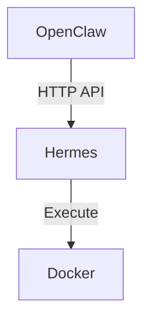

# AGENTS.md - Guides Repository Guide

This file provides context for AI agents working with the `derekleeds/guides` repository (guides.derekleeds.cloud).

## Overview

**Purpose:** Technical documentation and guides for OpenClaw, homelab, and DevOps/SecOps topics  
**URL:** https://guides.derekleeds.cloud  
**Tech Stack:** Hugo + Docsy theme (Markdown → Static HTML)  
**Hosting:** Netlify (auto-deploy on push to main)  
**Build Time:** ~2-3 minutes

## Repository Structure

```
guides/
├── content/en/         # English content (primary)
│   ├── docs/           # Documentation pages
│   │   ├── openclaw/   # OpenClaw guides
│   │   ├── homelab/    # Homelab infrastructure
│   │   └── _index.md   # Section index pages
│   └── _index.md       # Homepage
├── assets/             # Images, static files
├── layouts/            # Custom Hugo templates
├── themes/docsy/       # Docsy theme (submodule)
├── config.yaml         # Hugo configuration
├── hugo.yaml           # Hugo module config
├── package.json        # Node.js dependencies
└── go.mod              # Go modules (Hugo)
```

## Content Format

All content is Markdown with Hugo frontmatter:

```yaml
---
title: "Guide Title"
date: 2026-04-14
description: "Brief description for SEO and cards"
author: "Derek Leeds"
categories:
  - Category Name
tags:
  - tag1
  - tag2
draft: false  # Set true for drafts
---

Content in Markdown. Supports Hugo shortcodes, diagrams (Mermaid), and more.
```

### File Location

Content lives in `content/en/docs/<category>/<slug>.md`

URL mapping: `content/en/docs/openclaw/my-guide.md` → `https://guides.derekleeds.cloud/docs/openclaw/my-guide/`

## Publishing Workflow

1. **Draft in Obsidian** → `2_Areas/OpenClaw & AI work/Guides Posts/`
2. **Review and edit** → Technical accuracy, voice alignment
3. **Move to Hugo format** → `content/en/docs/<category>/<slug>.md`
4. **Commit and push to main** → Netlify auto-deploys
5. **Live in ~3 minutes**

### Local Development

```bash
# Install dependencies
npm install

# Run Hugo server with Docsy
hugo server --minify --disableFastRefresh

# Access at: http://localhost:1313
```

Or use Docker:

```bash
docker-compose up
```

## Content Guidelines

- **Voice:** Direct, practical, no marketing fluff
- **Audience:** Derek's future self + technical peers
- **Tone:** Concise, actionable, assume technical competence
- **Length:** 1000-3000 words for comprehensive guides
- **Code blocks:** Use triple backticks with language (bash, python, yaml, etc.)
- **Diagrams:** Mermaid syntax supported
- **Images:** Store in `assets/`, reference with `/assets/` paths

### Writing Style

- Use "you" for reader, "I" for Derek's experiences
- Avoid AI hype words (revolutionize, supercharge, game-changer, unlock)
- Prefer active voice
- Include real examples from Derek's homelab
- Link to related guides and external docs

## Technical Details

### Hugo Version
- Defined in `go.mod`
- Extended version for SCSS support

### Docsy Theme
- Version locked in `themes/docsy/`
- Custom overrides in `layouts/`

### Dependencies

```bash
# Node.js (check .nvmrc for version)
npm install

# Hugo (via Homebrew or snap)
brew install hugo
```

### Build Verification

Before pushing:

```bash
hugo --minify
```

Check for:
- Broken links (`hugo --minify --verbose`)
- Missing images
- Frontmatter errors

## Common Tasks

### Create New Guide

1. Create file: `content/en/docs/<category>/<slug>.md`
2. Add frontmatter (title, date, description, author, categories, tags)
3. Write content with proper heading hierarchy (##, ###, ####)
4. Add to section navigation (update `_index.md` if needed)
5. Test locally: `hugo server`
6. Commit and push

### Update Existing Guide

1. Edit the markdown file
2. Update `Last updated:` date at bottom if significant changes
3. Commit with descriptive message
4. Push — Netlify auto-deploys

### Add New Category

1. Create directory: `content/en/docs/<new-category>/`
2. Create `_index.md` for the section:
   ```yaml
   ---
   title: "Category Name"
   description: "Section description"
   cascade:
     - type: docs
   ---
   ```
3. Add to navigation in `config.yaml` or theme config

### Add Diagrams (Mermaid)

```markdown

```

## Agent Instructions

When working with this repo:

1. **Read existing guides** in `content/en/docs/` to match style and structure
2. **Verify frontmatter** — Hugo requires valid YAML
3. **Check internal links** — Use relative paths or absolute `/docs/...` paths
4. **Test builds locally** before pushing when possible
5. **Preserve URLs** — Changing slugs breaks existing links (add redirects if needed)
6. **Update navigation** — Add new guides to section `_index.md` or config
7. **Check for broken links** — Run `hugo --minify --verbose` to catch issues

## Netlify Configuration

- **Build command:** `hugo --minify`
- **Publish directory:** `public/`
- **Branch:** main (auto-deploy)
- **Environment:** Hugo version set in Netlify UI

### Build Logs

If build fails:
1. Check Netlify deploy log for specific error
2. Common issues: missing theme submodule, frontmatter syntax, broken shortcodes
3. Test locally with `hugo --minify --verbose`

## Related Repositories

- **journal** — Personal learning blog (Jekyll)
- **OpenClaw workspace** — Agent configuration and skills
- **Obsidian Vault** — Source of truth for notes (not in git)

## Troubleshooting

| Issue | Solution |
|-------|----------|
| Build fails | Check Hugo version matches `go.mod`, verify frontmatter |
| Theme missing | Run `git submodule update --init --recursive` |
| Guide not showing | Verify `draft: false`, check file path in `content/en/docs/` |
| 404 on guide | Check URL mapping, verify `_index.md` exists for section |
| Images broken | Use `/assets/<path>` not relative paths |
| Navigation broken | Update section `_index.md` or `config.yaml` navigation |

## Deployment Checklist

Before pushing to main:

- [ ] Frontmatter is valid YAML
- [ ] Filename matches intended URL slug
- [ ] Internal links use correct paths (`/docs/category/slug/`)
- [ ] Images in `assets/` with correct references
- [ ] No TODO or placeholder text
- [ ] Build passes locally: `hugo --minify`
- [ ] Categories and tags are consistent with existing guides

## Contact

For questions or issues, contact Derek Leeds:
- Email: contact@derekleeds.com
- GitHub: @derekleeds

---

*Last updated: 2026-04-14*
