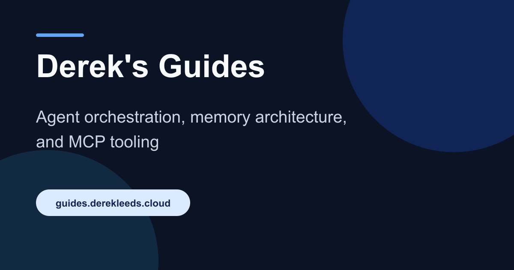

<div align="center">

# Derek's Guides

**Practical technical documentation for AI agents, memory, MCP, infrastructure, and security.**

[](https://guides.derekleeds.cloud/)
[](https://starlight.astro.build/)
[](LICENSE)
[](http://localhost:3000/homelab/guides)
[](https://github.com/derekleeds/guides)

<a href="https://guides.derekleeds.cloud/">
  
</a>

</div>

## About

[guides.derekleeds.cloud](https://guides.derekleeds.cloud/) is a standalone reference site for longer, task-focused documentation. Learn remains the home for journal-style writing; Guides is for material meant to be followed more than once.

## Tech stack

| Component                                                                             | Technology              | Purpose                                                                                  |
| :------------------------------------------------------------------------------------ | :---------------------- | :--------------------------------------------------------------------------------------- |
|            | **Astro 7 + Starlight** | Builds the static documentation site, navigation, search, and accessible page structure. |
|      | **Markdown and MDX**    | Stores durable, reviewable guide content.                                                |
|            | **React**               | Supports Keystatic and the small interactive surfaces that require it.                   |
|  | **TypeScript**          | Keeps configuration and content integrations predictable.                                |
|              | **pnpm**                | Installs the pinned dependency graph and runs project checks.                            |
|  | **Cloudflare Pages**    | Publishes the generated static site.                                                     |

## Local development

Requirements:

- Node.js 22.12 or newer
- pnpm 11.19.0

```bash
pnpm install --frozen-lockfile
pnpm dev
```

The site and local Keystatic editor are available at `http://localhost:4321/` and `/keystatic`.

## Content

Guide pages live under `src/content/docs/docs/`. For example:

```text
src/content/docs/docs/openclaw/example.md
  → /docs/openclaw/example/
```

Keep published slugs stable and use absolute site paths such as `/docs/memory-management/` for internal links.

## Production checks

```bash
pnpm build
pnpm format:check
pnpm preview
```

Astro writes the site to `dist/`.

## Project checklist

- [x] Publish a standalone Starlight documentation site
- [x] Separate reusable guides from Learn journal posts
- [x] Organize guides by technical domain
- [x] Provide local Markdown and Keystatic editing
- [x] Preserve stable `/docs/...` routes
- [x] Add search, sitemap, and social metadata
- [x] Keep Forgejo as the source of truth
- [x] Mirror `main` one way to GitHub for Cloudflare Pages deployment
- [x] Publish the production site at `guides.derekleeds.cloud`

## Deployment

| Setting           | Value            |
| :---------------- | :--------------- |
| Production branch | `main`           |
| Build command     | `pnpm build`     |
| Build output      | `dist`           |
| Node.js           | `22.12` or newer |

```text
Forgejo homelab/guides
  → GitHub derekleeds/guides
  → Cloudflare Pages
  → guides.derekleeds.cloud
```

## Architecture and license

Learn and Guides are intentionally separate sites. The decision and migration boundaries are recorded in [CMS_ARCHITECTURE.md](CMS_ARCHITECTURE.md).

Licensed under the [Apache License 2.0](LICENSE).
