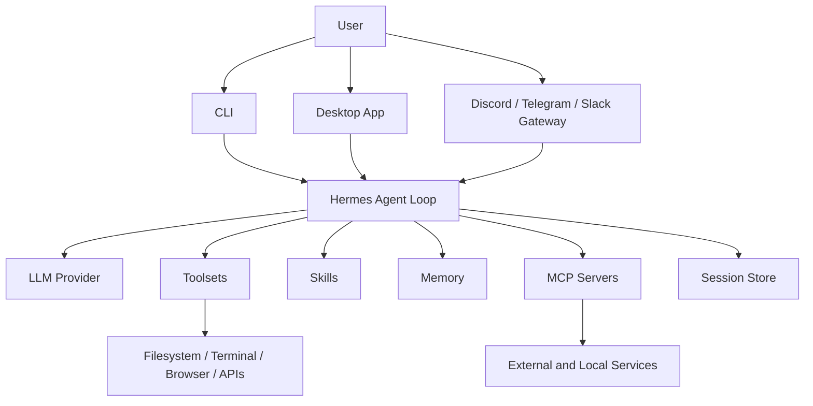

Hermes Agent is easiest to understand as a runtime made of layers. The model is
important, but it is only one layer. The useful behavior comes from the way the
model is wrapped with tools, skills, memory, profiles, and gateway adapters.



## Agent Loop

At the center is the agent loop:

1. Build context from the system prompt, user request, active skills, memory,
   and available tools.
2. Ask the model what to do next.
3. If the model calls a tool, execute the tool and feed the result back in.
4. Repeat until the task is complete or the turn budget is exhausted.

This loop is what turns Hermes from a text generator into an operator. It can
inspect the environment, make targeted edits, run validations, and report the
actual result.

## Model and Provider Layer

Hermes is provider-agnostic. It can use OpenRouter, Anthropic, OpenAI-compatible
endpoints, local models, and other supported providers. That matters because
agent workloads are not all the same.

- Fast routing models are useful for simple questions.
- Strong reasoning models are useful for planning and debugging.
- Local models are useful for privacy-sensitive or offline workflows.
- Auxiliary models can handle tasks like vision, summarization, or compression.

The practical rule: choose the cheapest model that can safely complete the task,
but do not under-power infrastructure decisions just to save fractions of a
cent.

## Toolsets

Toolsets are the capability boundary. A Hermes session may have access to files,
terminal commands, browser automation, web search, GitHub, Home Assistant, cron
jobs, image generation, or other integrations.

Tool access should match the job. A writing assistant does not need terminal
access. An SRE assistant probably does. A public gateway profile should be more
constrained than a local CLI profile.

## Skills

Skills are procedural memory. They are Markdown documents with instructions,
commands, pitfalls, and validation steps for recurring tasks.

A good skill answers: "When this task appears again, what exact workflow should
Hermes follow?"

Examples:

- Deploying a Komodo-managed Docker Compose stack.
- Publishing a guide to a Hugo/GitHub Pages site.
- Reindexing the Obsidian search service.
- Running a Kubernetes migration assessment.

Skills prevent rediscovering the same footguns every week, which is nice because
there are only so many times a person should have to learn that a service is
GitHub Pages-backed and not Netlify-backed.

## Memory

Memory is for stable facts: preferences, environment conventions, durable
lessons, and recurring constraints. It is not a task log and it is not where
secrets belong.

Bad memory:

```text
Fixed PR #123 today.
```

Good memory:

```text
The guides site is hosted by GitHub Pages and mirrored into the Obsidian vault.
```

For project notes, runbooks, incident records, and plans, use Obsidian. For code
and manifests, use Git. For procedures, use skills.

## Profiles

Profiles let multiple Hermes instances have different configuration, tools,
skills, and memory scopes. This is useful for separating roles:

- default operator profile
- coding-focused profile
- read-only reviewer profile
- WordPress/operator profile
- automation or cron-focused profile

Profiles are how you stop one all-powerful assistant from becoming a junk drawer
with root-adjacent ambitions.

## Desktop and Gateway

The [Hermes Agent Desktop app](https://hermes-agent.nousresearch.com/desktop)
gives Windows and macOS users a local chat-first interface. The gateway lets
Hermes run through messaging platforms like Discord, Telegram, Slack, and
others. In my setup, Discord is the conversational control plane for homelab
operations.

Gateway mode is powerful because it puts operational workflows where the work is
being discussed. It also increases the need for clear approval boundaries,
careful tool exposure, and concise status updates.

## MCP Servers

MCP servers expose external systems as typed tools. Instead of scraping
dashboards or asking Hermes to invent API calls, MCP gives it structured access
to known capabilities.

In a homelab, useful MCP integrations include:

- inventory and dependency data
- Git hosting
- note search
- infrastructure APIs
- monitoring systems

MCP is not magic. It is an integration boundary. Treat each server like an API
client with permissions, credentials, and operational blast radius.

## The Operating Boundary

The architecture is only useful if the boundary is clear:

- **Documentation** lives in Obsidian or the public guides repo.
- **Infrastructure source** lives in Forgejo or GitHub, depending on the repo.
- **Runtime state** is evidence, not source of truth.
- **Secrets** live in 1Password, environment files, or SOPS-encrypted manifests.
- **Hermes** investigates, edits, validates, and documents within those rules.

That is the difference between an agent and an enthusiastic shell history
generator.
