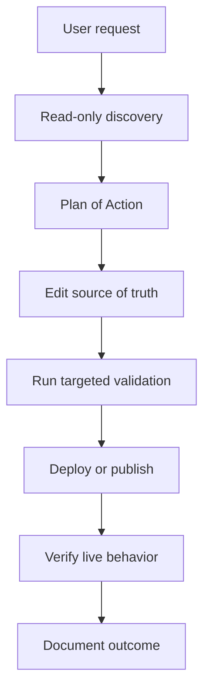

Hermes is most useful when it acts like an SRE assistant, not a magic production
button. The workflow is simple: investigate, plan, change the source of truth,
validate the result, and document what happened.

That order matters.

## Operating Principles

My homelab has a few rules for Hermes-driven work:

- **Forgejo is the source of truth** for private infrastructure state.
- **GitHub is the source of truth** for public guides like this site.
- **Komodo manages Docker Compose infrastructure and management-plane stacks.**
- **ArgoCD manages Kubernetes application workloads.**
- **Talos nodes are immutable.** No SSH archaeology, no hand-edited snowflakes.
- **Secrets stay out of chat and docs.** Use 1Password, environment references,
  or SOPS-encrypted files.
- **Documentation is part of the task.** If it is not documented, it did not
  happen.

Hermes can help with every part of that flow, but it does not get to invent a
new source of truth because it found a convenient command.

## The Standard Workflow



### 1. Read-Only Discovery

Start by inspecting what exists:

- current Git status
- relevant repo files
- prior Obsidian notes
- existing skills
- live state from safe read-only APIs
- recent logs, if needed

This prevents solving a different problem than the one actually present.
Infrastructure has enough legacy debt without adding agent-generated fan
fiction.

### 2. Plan of Action

For migrations, incidents, and risky changes, Hermes should draft a plan before
editing anything. The plan should include:

- scope
- assumptions
- risks
- rollback path
- acceptance criteria
- validation commands

For simple documentation edits, this can be lightweight. For cluster work, it is
the difference between engineering and poking the bear with YAML.

### 3. Edit the Source of Truth

Hermes should prefer declarative changes:

| Target               | Source of truth                                 |
| -------------------- | ----------------------------------------------- |
| Docker Compose stack | Komodo-managed repo path                        |
| Kubernetes workload  | Helm chart and ArgoCD application               |
| Talos configuration  | machine config patch or tracked config artifact |
| Public guide         | GitHub Hugo source                              |
| Operational note     | Obsidian vault                                  |

Live commands are for discovery, validation, and controlled operations. They are
not a substitute for tracked state.

### 4. Validate

Validation should match the risk:

- format check for Markdown
- Hugo build for guide changes
- `helm template` or chart lint for Kubernetes changes
- targeted tests for code changes
- API read-back for external systems
- live endpoint checks after deployment

Hermes should report what actually ran and what it returned. "Looks good" is not
a validation strategy; it is a sentence people write before opening an incident.

### 5. Document

For public guides, mirror the content into Obsidian. For infrastructure changes,
update the relevant project plan, runbook, or architecture decision record.

The written record should include:

- what changed
- why it changed
- where the source artifact lives
- how it was validated
- what risk remains

## Example: Publishing a Guide

A safe Hermes publishing request looks like this:

```text
Create a Hermes Agent guide section in the guides repo. Mirror the posts into Obsidian, run the Hugo production build, and report the changed files. Do not push until validation passes.
```

Hermes should then:

1. Check the existing guide style.
2. Create or edit Markdown in `content/en/docs/...`.
3. Mirror the article into the vault.
4. Update indexes.
5. Run formatting/build checks.
6. Show the diff and validation result.

That is an agent workflow with a paper trail.

## Example: Kubernetes Application Change

For Kubernetes, Hermes should prefer a Helm/ArgoCD path:

1. Inspect the existing chart and ArgoCD application layout.
2. Update chart values or templates.
3. Render with `helm template`.
4. Run static checks where available.
5. Commit the change.
6. Let ArgoCD reconcile.
7. Verify the application health and endpoint behavior.

It should not SSH into a node and hand-edit files. Talos would not allow that
anyway, because Talos has self-respect.

## Example: Komodo Stack Change

For a Docker Compose stack managed by Komodo:

1. Find the repo-backed stack definition.
2. Update `docker-compose.yml`, `.env.example`, or `stack.toml` as needed.
3. Avoid plaintext secrets.
4. Validate the Compose file.
5. Commit the change.
6. Trigger or observe Komodo reconciliation.
7. Verify the service from the outside.

Runtime fixes without Git changes are treated as temporary incident response,
not as completion.

## The Human Approval Boundary

Hermes can do a lot, but approval still matters. I want explicit confirmation
before:

- destructive file operations
- network topology changes
- DNS or exposure changes
- credential rotation
- deleting data
- modifying production cluster state

The goal is not to slow everything down. The goal is to keep the agent on the
right side of the blast-radius line.

## The Practical Benefit

The benefit is not that Hermes makes infrastructure effortless. It makes the
boring discipline easier to repeat:

- read before writing
- write the source of truth
- validate the result
- document the outcome
- preserve the lesson as a skill when useful

That is the useful version of AI operations: less ritual, more reproducibility.
