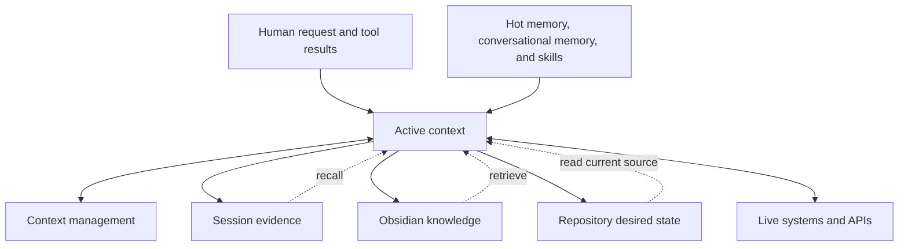
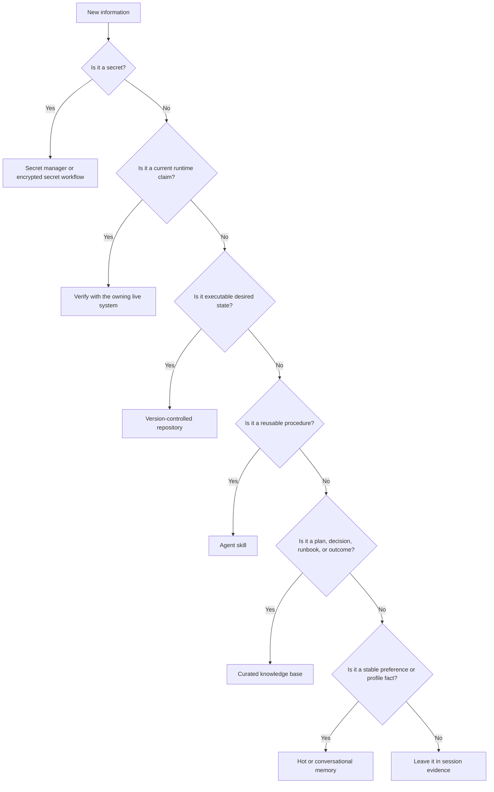

An AI agent does not have one memory. It has several systems that preserve different kinds of information for different lengths of time.

That distinction matters. A transcript can prove what was said, but it is a poor place to maintain a runbook. A vector index can find a configuration note, but it cannot prove that the live service still matches it. A model's context window can hold today's task, but it should not become the permanent home of every fact the agent has ever seen.

This guide builds a practical memory architecture from beginner concepts through a production operating model. The examples use [Hermes Agent](https://hermes-agent.nousresearch.com/), [Honcho](https://honcho.dev/), [Obsidian](https://obsidian.md/), and [Lossless Claw](https://github.com/Martian-Engineering/lossless-claw), but the boundaries apply to most coding and agentic harnesses.

:::tip[The rule that prevents most memory problems]
Give each kind of information one authoritative home, then retrieve it when needed. Do not make every storage layer a copy of every other layer.
:::

## The short version

| Layer                 | What it answers                                             | Good home                                     | Lifetime                    |
| --------------------- | ----------------------------------------------------------- | --------------------------------------------- | --------------------------- |
| Active context        | What must the model know for this turn?                     | Current prompt and tool results               | One model call or session   |
| Session evidence      | What was actually said or done?                             | Session database or transcript                | Long-lived evidence         |
| Context management    | How can a long session keep going?                          | Summaries with expandable history             | Session lifetime            |
| Hot memory            | Which compact facts should appear often?                    | Curated profile or memory files               | Cross-session               |
| Conversational memory | What patterns or user context were learned over time?       | An optional memory provider such as Honcho    | Cross-session               |
| Procedural memory     | How should this recurring task be performed?                | Versioned agent skills                        | Until the procedure changes |
| Curated knowledge     | What plans, decisions, investigations, and runbooks matter? | Obsidian or another maintained knowledge base | Durable                     |
| Desired state         | What should machines and applications run?                  | A version-controlled repository               | Durable and auditable       |
| Runtime truth         | What is happening now?                                      | The owning live API or system                 | Current at query time       |

The architecture is a set of boundaries, not a shopping list. Start with the layers your harness already provides. Add another component only when it solves a demonstrated retrieval, continuity, or governance problem.

## How the layers work together

The arrows into active context are retrieval paths. They do not imply that every source is loaded on every turn. Selective retrieval keeps the prompt focused and reduces the chance that stale or irrelevant material will crowd out the current task.

## 1. Active context is working memory

Active context is everything the model can see during the current call: system instructions, recent messages, selected files, memory snippets, tool descriptions, and tool results.

It is fast and immediately useful, but temporary and limited. Treat it like a workbench:

- keep the current objective and constraints visible;
- retrieve only the documents needed for this decision;
- summarize large outputs before carrying them forward; and
- do not assume information remains available after a new session or compaction.

A larger context window delays pressure; it does not remove the need to decide what belongs there.

## 2. Session history is evidence

A session store preserves the conversation and tool chronology. It answers questions such as:

- What did we agree to?
- Which command failed?
- Where did this investigation stop?
- What evidence supported the previous conclusion?

This history should be searchable, but it should not become the primary home for stable instructions or operational documentation. The important distinction is **recall versus authority**: finding a statement in an old conversation proves that it was said, not that it remains correct.

[Hermes Agent](https://hermes-agent.nousresearch.com/docs) keeps sessions in a searchable local store and exposes session recall separately from its curated memory files. Other harnesses use transcripts, checkpoints, or project histories for the same purpose.

## 3. Context management preserves continuity

Long conversations eventually exceed the amount of history that can remain active. Context-management systems compact older material into summaries while retaining a route back to the underlying evidence.

[Lossless Context Management with Lossless Claw](/docs/openclaw/lossless-claw/) is one example. It keeps recent messages active, summarizes older sections, and lets an agent expand earlier material when details become relevant again.

Context management solves continuity, not durable knowledge:

- a summary is not a maintained runbook;
- an expandable transcript is not desired infrastructure state; and
- compaction does not decide which lessons deserve promotion into long-term memory.

## 4. Hot memory holds compact stable facts

Most agent harnesses benefit from a small, frequently available layer for stable facts: communication preferences, environment conventions, recurring constraints, and concise operating assumptions.

In Hermes, built-in memory uses human-readable files for the user profile and agent notes. The [Hermes memory-provider documentation](https://hermes-agent.nousresearch.com/docs/user-guide/features/memory-providers) explains how this built-in layer remains active even when an optional external provider is enabled.

Keep hot memory deliberately small:

- save facts that will prevent repeated steering;
- replace stale statements rather than appending contradictions;
- omit temporary task progress and artifact identifiers;
- put procedures in skills instead; and
- never store passwords, tokens, private keys, or decrypted secrets.

If a fact can be cheaply rediscovered from an authoritative source, retrieval is usually better than permanent prompt occupancy.

## 5. Conversational memory is optional and additive

An external memory provider can model patterns across sessions, retrieve related observations, or maintain a richer user representation. [Honcho](https://docs.honcho.dev/) is designed for this kind of long-term personalization and relationship context. Its [Hermes integration](https://docs.honcho.dev/v3/guides/integrations/hermes) adds cross-session recall without replacing Hermes' built-in files.

There are two useful operating modes:

1. **Automatic injection** places selected memories into context before a turn.
2. **Tools-only recall** lets the agent search or reason over memory only when the task needs it.

Automatic injection favors convenience. Tools-only recall favors tighter context control and clearer retrieval intent. Neither mode changes the authority rule: conversational memory can remind the agent of a preference or prior decision, but current external state should still be verified at its source.

Use peer or profile isolation when one memory service supports multiple assistants or roles. A coding agent, personal assistant, and infrastructure operator should not silently inherit one another's private observations merely because they share a backend.

## 6. Skills are procedural memory

A stable fact says **what is true**. A skill says **how to perform a recurring task**.

Skills are a better home for:

- ordered workflows;
- exact commands or API patterns;
- validation and rollback steps;
- tool-specific pitfalls; and
- reusable templates or scripts.

For Hermes, see [Skills, Memory, and Context](/docs/hermes/hermes-skills-memory-context/) and [Getting Started with Hermes Agent](/docs/hermes/getting-started-hermes-agent/). For the broader concept, [What AI Agents Actually Are](/docs/ai/what-ai-agents-actually-are/) explains how a model, harness, tools, permissions, and operating instructions work together.

Version procedures when possible. A reviewed skill in a repository is easier to audit and improve than a technique remembered only through old chats.

## 7. Obsidian is curated operational knowledge

[Obsidian as Human and Agent Memory](/docs/ai/recommended-tools/obsidian-skills/) explains why local Markdown works well for plans, decisions, investigations, runbooks, and verified outcomes.

The vault is not a transcript landfill. Curate the result of the work:

- record the decision and why it was made;
- link evidence and the owning source;
- state what was verified and when;
- preserve unresolved risk and next actions; and
- update or archive stale guidance.

Obsidian remains useful to both humans and agents because the files are ordinary Markdown. Search can be keyword, vector, or hybrid, but retrieval quality still depends on clear titles, metadata, links, and maintenance.

## 8. Repositories own desired state

Executable configuration, manifests, policies, code, and automation belong in version control—not in conversational memory or a prose note.

A repository provides reviewable diffs, history, rollback, and a machine-readable source of truth. The agent may use memory to locate the right repository or recall a convention, but it should read the current branch before changing anything.

This principle is especially important for infrastructure and security policy. See [APIs, MCP, and CLIs](/docs/ai/apis-mcp-and-clis/) for choosing an execution path, and [1Password Secrets Management](/docs/security/1password-secrets-management/) for keeping secret values out of prompts, notes, and repositories.

## 9. Live systems own runtime truth

Runtime claims age quickly. Health, deployed versions, active routes, storage capacity, access policy, and incident state should come from the system that currently owns them.

The safe pattern is:

1. use memory or documentation to identify the expected owner;
2. query the owning API or approved observability source;
3. compare runtime state with desired state; and
4. document the verified outcome if it will matter later.

This prevents a perfectly retrieved but obsolete note from masquerading as current truth.

## Promote information deliberately

When an agent learns something useful, decide where it belongs instead of copying it everywhere.

Promotion should be selective. Most intermediate reasoning can remain in session history. Durable layers should contain the result that future work can trust.

## Retrieval is not authority

Search is the route to memory, not the memory itself.

- **Keyword search** is strong when names and identifiers are known.
- **Vector search** helps when the wording differs but the meaning is related.
- **Hybrid search** combines both and may add reranking.
- **Graph or link navigation** helps when relationships among notes are meaningful.

Every retrieval system has freshness and scope boundaries. Before relying on a result, ask:

1. Which source produced it?
2. When was that source last updated or indexed?
3. Is the result evidence, desired state, or live truth?
4. Does a more authoritative source exist?

A memory hit should often lead to a source read, not directly to a conclusion.

## A minimal implementation path

Do not deploy nine products to obtain nine conceptual layers. Use the first rung that solves the actual problem.

### Stage 1: basic harness

Start with:

- active context;
- durable session history;
- one small curated memory file; and
- repository instructions for the current project.

This is enough for short coding and assistant workflows.

### Stage 2: repeatable operations

Add:

- versioned skills for recurring procedures;
- a maintained knowledge base for plans and decisions; and
- explicit source-of-truth rules for repositories and live systems.

This is the point where memory becomes an operating model rather than a feature toggle.

### Stage 3: long-running and cross-session agents

Add only where needed:

- context compaction for long sessions;
- an external conversational-memory provider for cross-session modeling;
- hybrid retrieval for a large document collection; and
- isolation, retention, and deletion controls for multiple profiles or agents.

Measure whether retrieval improves real tasks. A second index that returns the same notes is not architecture; it is another thing to wake you at 3 a.m.

## Common failure modes

| Failure                                        | Why it happens                          | Better boundary                                              |
| ---------------------------------------------- | --------------------------------------- | ------------------------------------------------------------ |
| Every transcript is copied into the vault      | Capture is mistaken for curation        | Preserve sessions as evidence; promote only durable outcomes |
| The same fact appears in several memory stores | Convenience creates conflicting copies  | Pick one owner and retrieve from it                          |
| A summary is treated as exact evidence         | Compaction hides detail                 | Expand or read the original session                          |
| Memory reports current infrastructure state    | A previously correct fact aged          | Query the live API                                           |
| Procedures live in profile memory              | Steps grow, drift, and evade review     | Move them into a versioned skill                             |
| Repository config is pasted into notes         | Prose becomes an unofficial fork        | Link to and read the canonical repository                    |
| Automatic recall floods every prompt           | Retrieval has no relevance threshold    | Use tighter filtering or tools-only recall                   |
| Secrets enter memory                           | Convenience bypasses lifecycle controls | Resolve them at runtime from a secret manager                |

## Security and privacy

Memory architecture is also data architecture. Before enabling automatic extraction or third-party storage, decide:

- which messages may leave the local environment;
- how users, profiles, and agents are isolated;
- what retention and deletion controls exist;
- whether sensitive fields can be excluded before ingestion;
- who can search conclusions or raw messages; and
- how provider credentials are resolved without entering logs or files.

Do not use an LLM memory store as a secret manager. Store secret references or retrieval instructions, never the secret values themselves.

## Continue learning

- [Earlier four-layer memory model](/docs/memory-management/) — the prior architecture, preserved for historical context
- [Use Obsidian as Human and Agent Memory](/docs/ai/recommended-tools/obsidian-skills/)
- [Skills, Memory, and Context in Hermes](/docs/hermes/hermes-skills-memory-context/)
- [Hermes Agent Architecture](/docs/hermes/hermes-agent-architecture/)
- [Lossless Context Management with Lossless Claw](/docs/openclaw/lossless-claw/)
- [OpenClaw and Hermes Agent Integration](/docs/openclaw/openclaw-hermes-integration/)
- [What AI Agents Actually Are](/docs/ai/what-ai-agents-actually-are/)
- [Agent Systems Glossary](/docs/ai/agent-systems-glossary/)
- [APIs, MCP, and CLIs](/docs/ai/apis-mcp-and-clis/)

## Official projects and references

- [Hermes Agent documentation](https://hermes-agent.nousresearch.com/docs)
- [Hermes memory providers](https://hermes-agent.nousresearch.com/docs/user-guide/features/memory-providers)
- [Hermes and Honcho](https://hermes-agent.nousresearch.com/docs/user-guide/features/honcho)
- [Honcho documentation](https://docs.honcho.dev/)
- [Obsidian](https://obsidian.md/)
- [Lossless Claw](https://github.com/Martian-Engineering/lossless-claw)
- [Mermaid](https://mermaid.js.org/)
- [Astro Mermaid](https://github.com/joesaby/astro-mermaid) and its [Starlight demo](https://starlight-mermaid-demo.netlify.app/)
